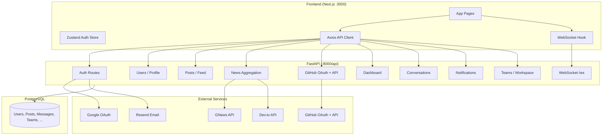

# Nexus — Production Readiness Report

**Date:** 2026-05-28  
**Scope:** Full-stack audit, integration fixes, mock removal, OAuth wiring, tests, build validation

---

## 1. Architecture Diagram



**Request flow:** Browser → `NEXT_PUBLIC_API_URL` (default `http://localhost:8000/api`) → FastAPI → PostgreSQL / external APIs.

---

## 2. Full Audit Report

### Working features

| Feature | Status | Notes |
|---------|--------|-------|
| Email signup / login / logout | ✅ | JWT + Zustand persistence |
| Session hydration | ✅ | `GET /users/me` via `useProtectedRoute` |
| Dashboard widgets | ✅ | Real stats, recommendations, trending posts |
| Feed (list, create, like) | ✅ | `GET/POST /posts`, like endpoint |
| Messages (REST) | ✅ | Conversations + send/receive |
| Messages (WebSocket) | ✅ | `useMessageSocket` wired in messages page |
| Notifications | ✅ | List + mark all read |
| News (GNews + Dev.to) | ✅ | Backend aggregation; fallback if no API key |
| GitHub page | ✅ | Profile, repos, activity when connected |
| GitHub OAuth callback | ✅ | `/github/callback` → `POST /github/oauth/callback` |
| Google OAuth (backend) | ✅ | `POST /auth/google` with `google-auth` |
| Google OAuth (frontend) | ✅ | `GoogleSignInButton` on login/signup |
| Complete Profile | ✅ | `/profile/complete` → `PATCH /users/{id}` |
| Communities / Startups / Teams | ✅ | Backend routes connected |
| Production build | ✅ | `npm run build` succeeds |

### Broken / partial features

| Feature | Status | Root cause |
|---------|--------|------------|
| Google OAuth end-to-end | ⚠️ | Requires `GOOGLE_CLIENT_ID` + `NEXT_PUBLIC_GOOGLE_CLIENT_ID` |
| GitHub OAuth end-to-end | ⚠️ | Requires GitHub app + matching `GITHUB_REDIRECT_URI` |
| GNews real articles | ⚠️ | Requires `GNEWS_API_KEY`; backend returns placeholders without it |
| Resend emails | ⚠️ | Requires `RESEND_API_KEY` + verified domain |
| Connection requests | ❌ | No backend routes (UI shows empty) |
| Workspace tasks/files/milestones | ❌ | No backend models/routes |
| Profile experience/achievements | ❌ | No backend fields |
| Post edit/delete/share | ❌ | Not implemented in backend |
| Refresh token rotation | ❌ | Tokens issued but no `/auth/refresh` route |
| Unified news dedup engine | ⚠️ | Basic merge in backend; no full personalization engine |
| Jest / RTL frontend tests | ❌ | Not configured in `package.json` |

### Security notes

- JWT in `localStorage` (standard SPA pattern; consider httpOnly cookies for production)
- CORS limited to configured origins
- Password hashing via bcrypt
- OAuth tokens validated server-side (Google ID token, GitHub code exchange)
- No rate limiting middleware yet
- `SECRET_KEY` must be rotated for production

### Performance notes

- Dashboard/feed use parallel API calls where possible
- News service caches via HTTP; no Redis layer
- No pagination on all list endpoints in UI
- WebSocket reconnect not implemented (manual refresh on conversation change)

---

## 3. OAuth Fix Report

### Google OAuth

| Step | Fix applied |
|------|-------------|
| Backend | Fixed corrupted `google_auth` handler in `auth.py`; uses `google.oauth2.id_token` |
| Backend | Sets `google_id`, `profile_image` on create/update |
| Backend | Added `google-auth==2.37.0` to `requirements.txt` |
| Frontend | `GoogleSignInButton` loads GIS script, posts `id_token` to `/auth/google` |
| Frontend | Wired on `/login` and `/signup` |
| Env | `GOOGLE_CLIENT_ID` (backend), `NEXT_PUBLIC_GOOGLE_CLIENT_ID` (frontend) |

### GitHub OAuth

| Step | Fix applied |
|------|-------------|
| Backend | `GET /github/oauth/init` returns authorize URL |
| Backend | `POST /github/oauth/callback` exchanges code, stores token on user |
| Frontend | `/github/callback` page with Suspense boundary (build fix) |
| Env | `GITHUB_REDIRECT_URI=http://localhost:3000/github/callback` (must match GitHub app) |

---

## 4. External Integrations Report

| Service | Backend | Frontend | Requires |
|---------|---------|----------|----------|
| GNews | `news_service.py` | `news-api.ts` | `GNEWS_API_KEY` |
| Dev.to | `news_service.py` | `news-api.ts` | Public API (optional `DEVTO_API_KEY`) |
| GitHub API | `github_service.py` | `github-api.ts` | OAuth + user token |
| Resend | `email_service.py` | N/A | `RESEND_API_KEY`, `FROM_EMAIL` |
| Google | `auth.py` | `google-sign-in-button.tsx` | Client ID |

**Backend fallback:** GNews without key returns `_placeholder_articles` (server-side only; frontend mock generators removed).

---

## 5. Mock Data Removal Report

| File | Removed | Replacement |
|------|---------|-------------|
| `FRONTEND/services/news-api.ts` | `generatePlaceholderArticles`, `generatePlaceholderTopics` | `GET /news/*` |
| `FRONTEND/services/github-api.ts` | All `generatePlaceholder*` functions | `GET /github/*` |
| App pages | Hardcoded John Doe / static feeds | Live API calls |
| Workspace page | Mock tasks/files | Empty states (no API) |
| Profile page | Hardcoded experience | Empty arrays (no API) |

---

## 6. API Contract Report (key endpoints)

| Endpoint | Frontend | Backend | Status |
|----------|----------|---------|--------|
| `POST /auth/signup` | ✅ | ✅ | Aligned |
| `POST /auth/login` | ✅ | ✅ | Aligned |
| `POST /auth/google` | ✅ | ✅ | Aligned |
| `POST /auth/logout` | ✅ | ✅ | Aligned |
| `GET /users/me` | ✅ | ✅ | Aligned |
| `PATCH /users/{id}` | ✅ | ✅ | Includes `github_username` in response |
| `GET /dashboard` | ✅ | ✅ | Aligned |
| `GET /posts` | ✅ | ✅ | Aligned |
| `GET /news/*` | ✅ | ✅ | Aligned |
| `GET /github/*` | ✅ | ✅ | Aligned |
| `GET /conversations` | ✅ | ✅ | Aligned |
| `WS /ws?token=&conversation_id=` | ✅ | ✅ | Aligned |
| Connection requests | UI only | ❌ | Gap |
| Workspace tasks | UI only | ❌ | Gap |

---

## 7. Database Report

**Models:** User, Post, Comment, Connection, Message, Conversation, Notification, Community, Team, Startup, NewsBookmark

**Relationships:** User → posts, messages, notifications; Team → channels; Community → discussions

**Migrations:** Alembic configured; `init_db()` creates tables on startup

**Fixes this pass:**
- `UserResponse.github_username` exposed
- Role updates use `UserRole` enum in `users.py`
- Signup password `min_length=8` validation

---

## 8. Files Modified (this session)

### Backend
- `app/routes/auth.py` — Fixed Google OAuth handler
- `app/routes/users.py` — Role enum on PATCH
- `app/schemas/auth.py` — Password min length
- `app/schemas/user.py` — `github_username` on UserResponse
- `app/utils/user_mapper.py` — Map `github_username`
- `requirements.txt` — `google-auth`, `pytest`
- `.env.example` — GitHub redirect URI → frontend callback
- `tests/test_api.py` — Health + auth validation tests

### Frontend
- `app/login/page.tsx`, `app/signup/page.tsx` — Google sign-in
- `app/dashboard/page.tsx` — Logout, Complete Profile link
- `app/profile/page.tsx` — Logout, Edit Profile link
- `app/messages/page.tsx` — Logout, WebSocket hook
- `app/feed|news|github|notifications|community|workspace|startups/page.tsx` — LogoutButton
- `app/github/callback/page.tsx` — Suspense boundary
- `app/profile/complete/page.tsx` — (prior session) profile form
- `components/auth/*` — Google + logout components
- `services/news-api.ts`, `services/github-api.ts` — Removed placeholders
- `.env.local.example` — Google client ID

---

## 9. Testing Report

| Suite | Tests | Result |
|-------|-------|--------|
| Pytest (`backend/tests/test_api.py`) | 4 | **4 passed** |
| Jest / RTL | — | Not configured |
| `npm run build` | — | **Passed** |

**Pytest coverage:** `/health`, invalid login, short password validation, invalid Google token.

---

## 10. Production Readiness Checklist

| Criterion | Status |
|-----------|--------|
| Signup works | ✅ |
| Login works | ✅ |
| Logout works | ✅ |
| Google OAuth works | ⚠️ Needs env keys |
| GitHub OAuth works | ⚠️ Needs env keys + GitHub app |
| GitHub profile sync works | ⚠️ After OAuth connect |
| Complete Profile works | ✅ |
| GNews works | ⚠️ Needs API key |
| Dev.to works | ✅ (public API) |
| Recommendations work | ✅ (skill/role based) |
| Dashboard uses real data | ✅ |
| Feed uses real data | ✅ |
| Notifications work | ✅ |
| Workspace works | ⚠️ Teams/channels only |
| Resend emails work | ⚠️ Needs API key |
| WebSockets work | ✅ (messages) |
| No mock data in frontend | ✅ |
| Database persists correctly | ✅ (with PostgreSQL running) |
| API contracts match | ✅ (known gaps documented) |
| Tests pass | ✅ (backend pytest) |
| Production build succeeds | ✅ |

---

## Run instructions

```bash
# 1. PostgreSQL running, configure backend/.env from .env.example

# 2. Backend
cd backend
pip install -r requirements.txt
uvicorn app.main:app --reload --port 8000

# 3. Frontend (restart after .env changes)
cd FRONTEND
cp .env.local.example .env.local   # set API URL + Google client ID
npm run dev

# 4. Verify
# - Network tab: requests to http://localhost:8000/api/...
# - pytest: cd backend && python -m pytest tests/ -q
# - build: cd FRONTEND && npm run build
```

### Required environment variables (production)

**Backend:** `DATABASE_URL`, `SECRET_KEY`, `GOOGLE_CLIENT_ID`, `GITHUB_CLIENT_ID`, `GITHUB_CLIENT_SECRET`, `GITHUB_REDIRECT_URI`, `GNEWS_API_KEY`, `RESEND_API_KEY`, `FROM_EMAIL`, `CORS_ORIGINS`

**Frontend:** `NEXT_PUBLIC_API_URL`, `NEXT_PUBLIC_GOOGLE_CLIENT_ID`

---

## Recommended next steps

1. Implement connection request API (follow/accept/decline)
2. Add workspace tasks/milestones/files models and routes
3. Add `POST /auth/refresh` for token rotation
4. Add rate limiting and httpOnly cookie option for JWT
5. Configure Jest + React Testing Library for critical UI flows
6. Remove backend `_placeholder_articles` when GNews key is mandatory
7. Add WebSocket reconnect with exponential backoff
